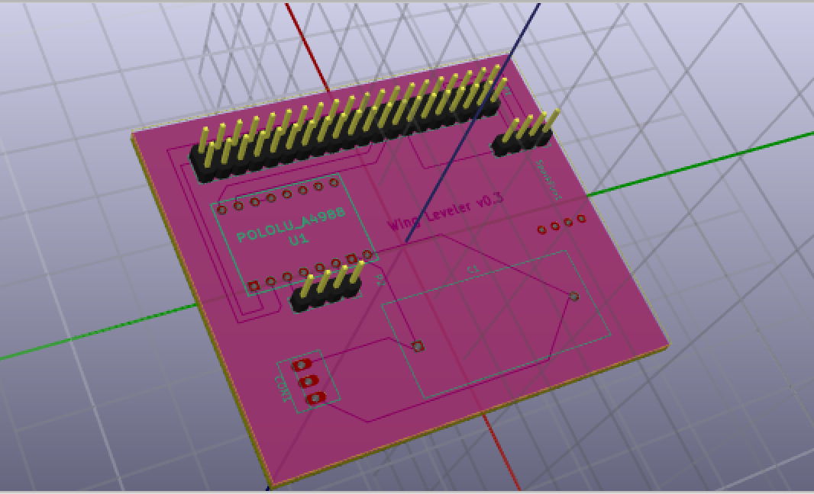

# Wing leveler

A portable wing leveler that attaches to the aircraft's yoke.

# Features

+ Portable, clamp-on device with a single point of attach
+ 12V, powered from the cigarette lighter socket
+ "Quick disconnect" button
+ "Follow present heading" button
+ Aural alarm if the aircraft departs more that 5 degrees from
assigned heading

# Technical highlights

+ 3d printed case
+ Raspberry Pi 3
+ InvenSense MPU-9250
+ NEMA 17 stepper motor
+ A4988 stepper driver

# Litterature

+ https://ocw.mit.edu/courses/aeronautics-and-astronautics/16-333-aircraft-stability-and-control-fall-2004/lecture-notes/

# Videos

+ https://www.youtube.com/watch?v=mazS7KZnoZ4
+ https://www.youtube.com/watch?v=BYXDKPSYu64
